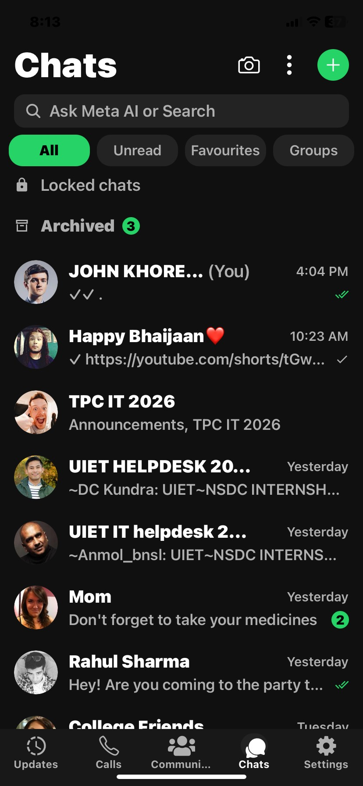
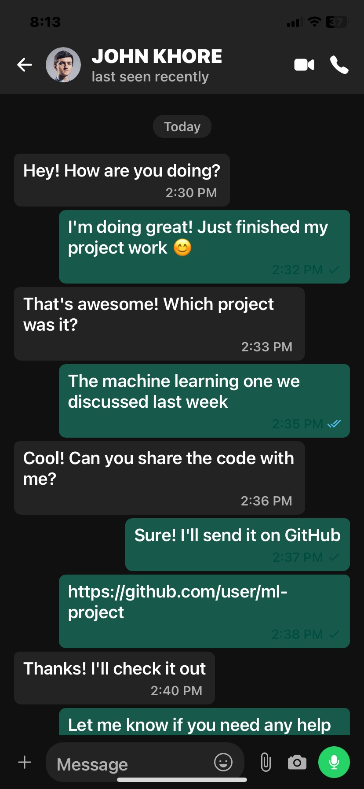

# WhatsApp-Style Push Notification App

## Vedaz Software Development Internship Assignment

**Applicant:** John
**Position:** React Native App Development Intern
**Assignment Deadline:** 14th July, 2025

---

## 📱 Project Overview

This repository contains a React Native mobile application developed as part of the Vedaz internship assignment. The app demonstrates real-time push notification functionality, inspired by WhatsApp's notification system, and is compatible with Android 15 and above.

---

## 🚀 Features

- Minimal, clean UI for chat and messaging (see screenshots below)
- Push notifications are received when triggered from the backend (simulated via hardcoded tokens for demonstration)
- Notifications are displayed even when the app is in the background or terminated
- Built using Expo for ease of handling both FCM (Firebase Cloud Messaging) and APNs (Apple Push Notification Service)
- All notification tokens are currently hardcoded for demonstration purposes
- Demonstrates understanding of backend integration and notification flows

---

## 🛠️ Technologies Used

- **React Native** (with Expo)
- **JavaScript** (for app logic)
- **Expo Notifications** (for cross-platform push notification handling)
- **Firebase Cloud Messaging (FCM)** (planned for production, simulated here)
- **AsyncStorage** (for local token storage)

---

## 📸 Screenshots

| Chats Screen           | Message Screen         |
|-----------------------|-----------------------|
|  |  |

---

## 🔗 Demo Video

A demonstration video of the app in action will be uploaded here:
[Demo Video Link (Google Drive)](https://drive.google.com/file/d/1Um5-HXGUDUUtX5omWM-SV57d5hObPnJU/view?usp=sharing)

---

## 📝 Assignment Requirements & Implementation

### Objective
- Build a React Native app with real-time push notification support, similar to WhatsApp.

### Functionality Implemented
1. **Basic App UI:**
   - Simple chat and message screens.
2. **Push Notification Integration:**
   - Notifications are received and displayed using Expo's notification system.
   - Notifications work when the app is in the background or killed.
   - Tokens are hardcoded for demonstration; in production, dynamic token management and backend integration would be implemented.
3. **Native Module (Planned):**
   - For this demo, Expo's managed workflow is used for rapid prototyping and cross-platform support. Native module integration (Java/Kotlin for Android) can be added as required.
4. **Notification Handling:**
   - Simulated backend triggers notifications using hardcoded tokens.

### Bonus Features (Planned/Future Work)
- Deep linking from notifications to specific screens
- Local notification storage and badge counts
- Backend simulation for notification triggers

---

## 💡 Notes
- All tokens and notification logic are currently hardcoded for demonstration purposes.
- I have a strong understanding of backend integration and can implement dynamic notification flows as required.
- The UI is intentionally minimal to focus on notification functionality.

---

## 📦 How to Run

1. Clone the repository:
   ```bash
   git clone [REPO_URL]
   cd [REPO_NAME]
   ```
2. Install dependencies:
   ```bash
   npm install
   ```
3. Start the Expo development server:
   ```bash
   npm start
   ```
4. Run the app on your device using the Expo Go app or a development build.

---

## 📬 Contact
For any questions or further information, please contact me at [johnkhore26@gmail.com]. 